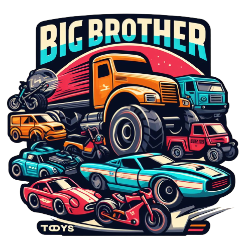
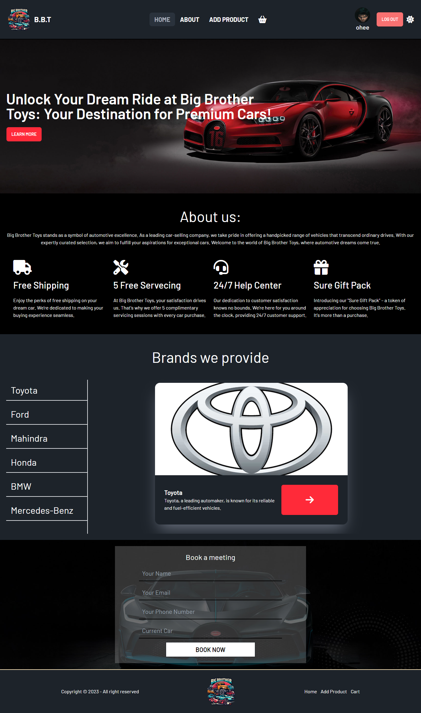

# Big Brother Toys (B.B.T)

## [Live link](https://assignment-10-f2c36.web.app/)
## [Api link](https://assignment-10-server-three-chi.vercel.app)

This was a pretty big project for me. I won't say it was tough to code. but it was tough to understand all the requirements and my gut feeling says if my numbers get reduced for any reason it might be that I couldn't understand the requirements. but I did my best to understand the requirements and deliver a project according to them. Let's hope for the best. Here are some features of my project:

1. This website has a dark and light mode so that the user can choose between their preferred mod. As a dev, I would recommend that dark mode is best for your eye and productivity.
2. As a car-selling website, you can see that we have a brand archive and in that, a visitor can check if we have their dream car or not.
3. On the website, I have an add product page. On that page, a valid user can add the product to the website. and not just add products but also can update the product details whenever it is necessary.
4. On the website, we have a login and registration page. If a user wants to use advanced features he/she has to register or log in to the website. 
5. In every car's single product page, we have a cart option visitor can add their favorite car to the cart, and on the cart page, they can see their chosen cars and also delete cars from their cart.

